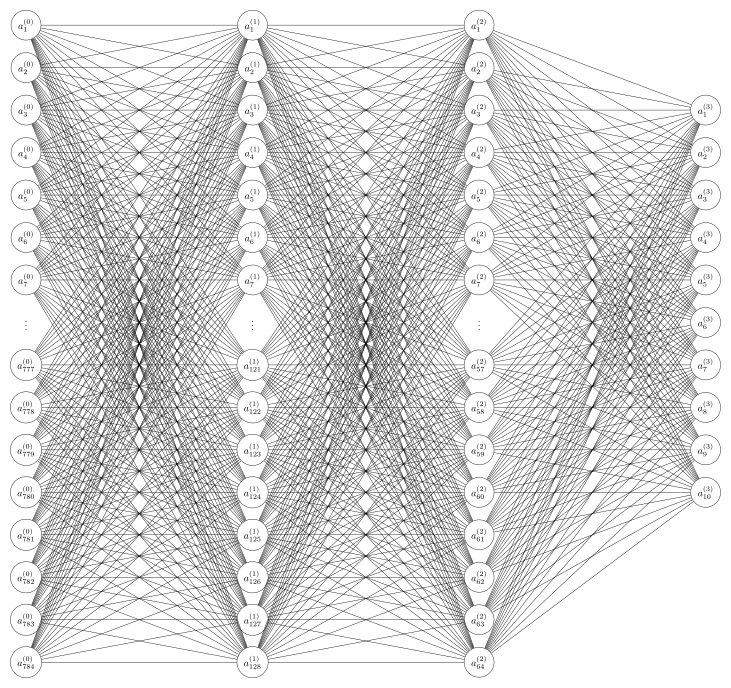
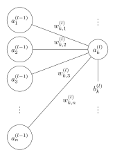
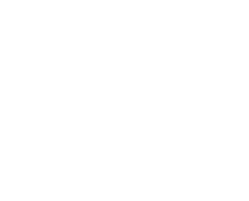

TODO: history of handwritten recognition and the MNIST, etc....

# Neural Network architecture

	

## 1.1. Gradient Descent (last layer)

if we were to consider the activation of the $k_{th}$ neuron in the last layer $l$ as illustrated:

	

the corresponding equation is,

$$
z^{(l)}_k = \Sigma_{i=1}^{n} w_{k, i} a^{(l-1)}_i + b^{(l)}_k
$$

We'll initially be using the sigmoïde ($\sigma$) activation function for its simplicity, but we will swap it later for one better suited to our problem. And so,

$$
a^{(l)}_k = \sigma{(z^{(l)}_k)}
$$

Gradient descent uses the derivative of the cost function $C$ which is defined as

$$
C = \frac{1}{2}\Sigma_j(a^{(l)}_j - y_j)^2
$$

where $j$ means the $j_{th}$ neuron in the output layer. $y_j$ is the corresponding desired output. That $\frac{1}{2}$ is there to cancel that exponent of $2$ when deriving. 

We take the sum of the (squared) differences because any given activation $a^{(l-1)}$ will affect all the neurons in the output layer. We don't really have any way to know where the error came from so we just sum all of them.

To apply the gradient descent algorithm, we need to take the derivative of the cost $C$ relative to a given weight or bias:

$$
\frac{\partial C}{\partial w_{k,i}}
= \frac{1}{2} \frac{\partial(\Sigma_j(a^{(l)}_j - y_j)^2)}{\partial w_{k,i}}
$$

Let's go slowly about this. Expanding that sum gives us:

$$
\frac{1}{2} \frac{\partial(\Sigma_j(a^{(l)}_j - y_j)^2)}{\partial w_{k,i}}
= \frac{1}{2}\frac{
		\partial((a_1^{(l)}-y_1)^2+\dots+(a_k^{(l)}-y_k)^2+\dots)
	}{
		\partial w_{k,i}
	}
$$

Notice that the only activation that depends on $w_{k,i}$ is $a_k$ and any other activation would be constant relative to $w_{k,i}$ and thus derive to null. So we get:

$$
\begin{align}
\frac{\partial C}{\partial w_{k,i}}
&= \frac{1}{2}\frac{\partial(a_k^{(l)}-y_k)^2}{\partial w_{k,i}}
&\text{(only the difference when $j=k$ remains)} \\ \\
&= \frac{1}{2} \times 2 (a^{(l)}_k-y_k)\frac{\partial a^{(l)}}{\partial w_{k,i}}
&\text{ (apply the chain rule)} \\ \\
&= (a^{(l)}_k-y_k)\frac{\partial \sigma(z^{(l)}_k)}{\partial w_{k,i}}
&\text{ (plug in $a^{(l)}$)} \\ \\
\end{align}
$$

Of course we have,

$$
\frac{\partial\sigma(z^{(l)}_k)}{\partial w_{k,i}}
=\frac{\partial\sigma(\Sigma_{j=1}^{n} w_{k,j} a^{(l-1)}_j + b)}{\partial w_{k,i}}
=\frac{
	\partial\sigma(
		w_{k,1} a^{(l-1)}_1 + \dots
		 + w_{k,i} a^{(l-1)}_i + \dots
		 + w_{k,n} a^{(l-1)}_n + b
	 )
 }{\partial w_{k,i}}
$$

>[!REMINDER]
> $n$ is the number of neurons in the layer $(l-1)$ (refer back to the illustration above)

applying the chain rule, all the $w_{k,j}\ a_j$ elements where $j\neq i$  are constants relative to $w_{k,i}$ and have a derivative $=0$. The only remaining element is where $j=i$ which is $w_{k,i}\ a_i^{(l-1)}$ and derives to $a_i^{(l-1)}$. Thus,

$$
\frac{\partial\sigma(z^{(l)}_k)}{\partial w_{k,i}}
= a_i^{(l-1)} \sigma'(z_k^{(l)})
$$

note that the same procedure when considering the derivative relative to $b_k$ yields:

$$
\frac{\partial \sigma(z_k^{(l)})}{\partial b_{k}^{(l)}}=\sigma'(z^{(l)}_k)
\ \ \ \ \ \ \ \ \ \
\text{(since $b$ has no coeffeicient, its derivative is 1)}
$$

plugging this result back in the cost function derivative we get,

$$
\frac{\partial C}{\partial w_{k,i}^{(l)}}
= (a_k^{(l)}-y)\,a_i^{(l-1)}\,\sigma'(z^{(l)})
$$

and for $b_k^{(l)}$,

$$
\frac{\partial C}{\partial b_k^{(l)}}
= (a_k^{(l)}-y)\ \sigma'(z^{(l)})
$$

note that the only element in that derivative that is specific to the $i_{th}$ weight $w_{k,i}$ is $a_i^{(l-1)}$. All of the other elements are coefficients in the derivative for any given $j_{th}$ weight in the $k_{th}$ output neuron. We generalize this formula for any weight of a $k_{th}$ output neuron by defining a **delta** as:

$$
\delta_k^{(l)}=(a_k^{(l)}-y)\sigma'(z_k^{(l)})
$$
and so this simplifies our final formulas to:

$$
\frac{\partial L_k}{\partial w^{(l)}_{k,i}}=a_i^{(l-1)} \delta^{(l)}_k
$$

and,

$$
\begin{align}
&\frac{\partial L_k}{\partial b_k^{(l)}}=\delta^{(l)}_k
&\text{}
\end{align}
$$

the sigmoïde has an interesting property:

$$
\sigma'(x) = \sigma(x) (1-\sigma(x))
$$

so using that in our formula we get,

$$
\frac{\partial C}{\partial w_{k,i}^{(l)}}
= (a_k^{(l)} - y)\ a_i^{(l-1)}\ \sigma(z_k^{(l)})(1-\sigma(z_k^{(l)}))
$$

We define the weight and bias update mechanisms as,

$$
\begin{align}
& w_{k,i}^{(l)} \leftarrow
w_{k,i}^{(l)} - \eta \frac{\partial L_k}{\partial w_{k,i}^{(l)}} \\
& b_k^{(l)} \leftarrow
b_k^{(l)} - \eta \frac{\partial L_k}{\partial b_k^{(l)}}
\end{align}
$$

where $\eta$ is the **learning rate**. A more concise notation:

$$
\begin{align}
& \Delta w^{(l)}_{k,i} = -\eta\ \delta_k^{(l)} a_i^{(l-1)} \\ \\
& \Delta b_k^{(l)} = -\eta\ \delta_k^{(l)}
\end{align}
$$

And that is the weight update formula of all the last layer's weights and biases.

But how about the updates across layers?

	

we'll try not to forget about the $b_i^{(l-1)}$. We didn't put it in the diagram because the space is kind of cramped.

How would we go about computing the weight update of any $w_{i,3}$? Well, we'll just take the error of all of the output neurons, sum them, and propagate them backward. That is what is called in machine learning **backpropagation**.

$$
w_{i,3} \leftarrow w_{i,3}-\eta\ \delta^{(l-1)}_i\ a_3^{(l-2)}
$$

$$
\Sigma_{k=1}^{10}
$$
